<table>
 <tr>
  <td>Splash Screen</td>
  <td>Login Screen</td>
 </tr>
 <tr>
 <td></td>
 <td>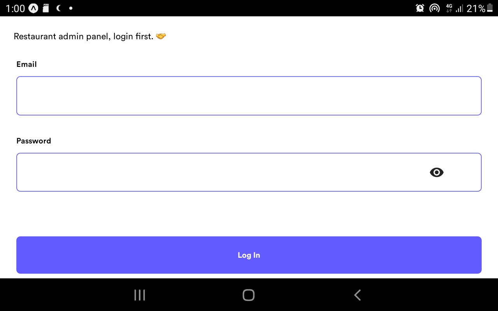</td>
 </tr>
</table>

<table>
 <tr>
  <td>New Orders Screen</td>
  <td>New Detailed Orders Screen</td>
 </tr>
 <tr>
 <td>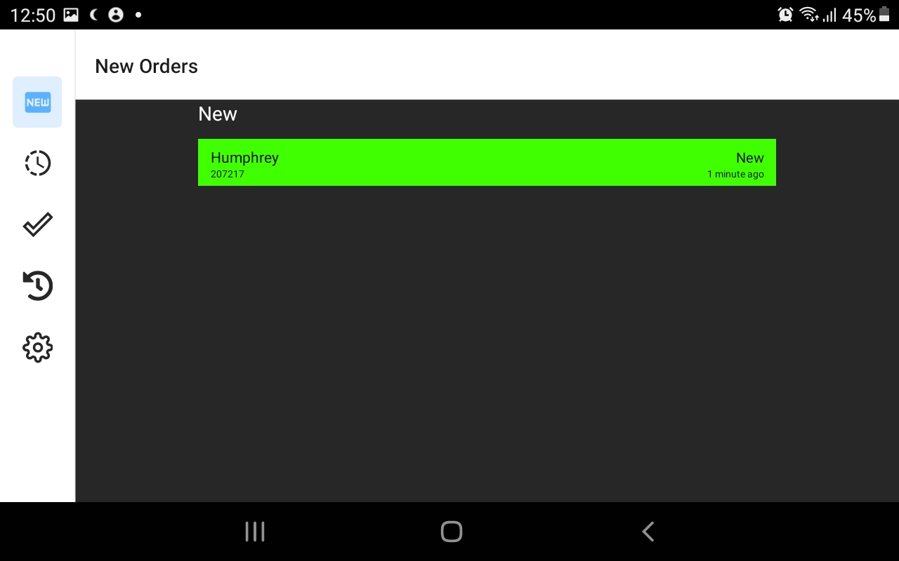</td>
 <td>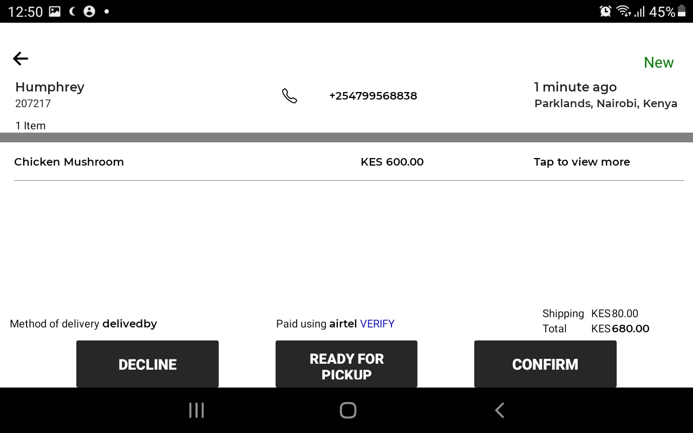</td>
 </tr>
</table>

<table>
 <tr>
  <td>Orders In Progress Screen</td>
  <td>Detailed Orders In Progress Screen</td>
 </tr>
 <tr>
 <td>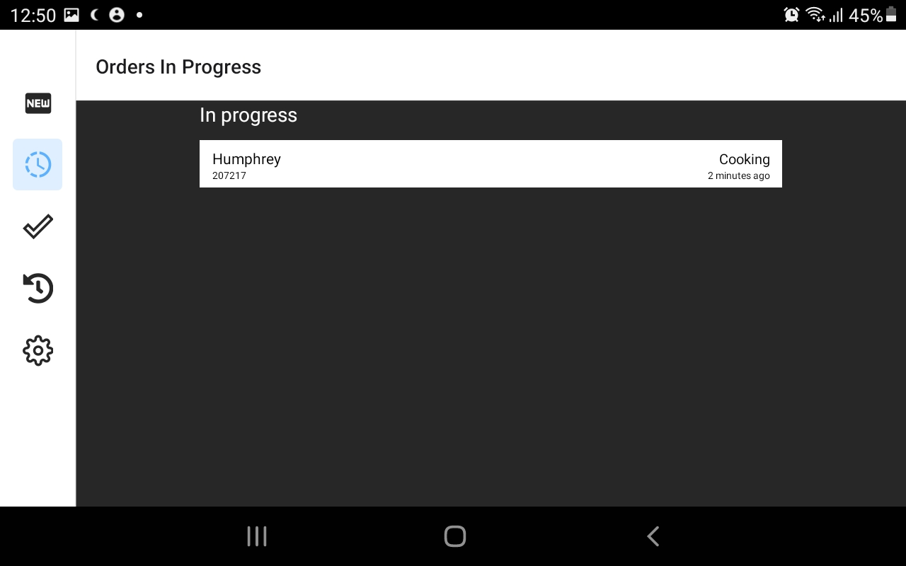</td>
 <td>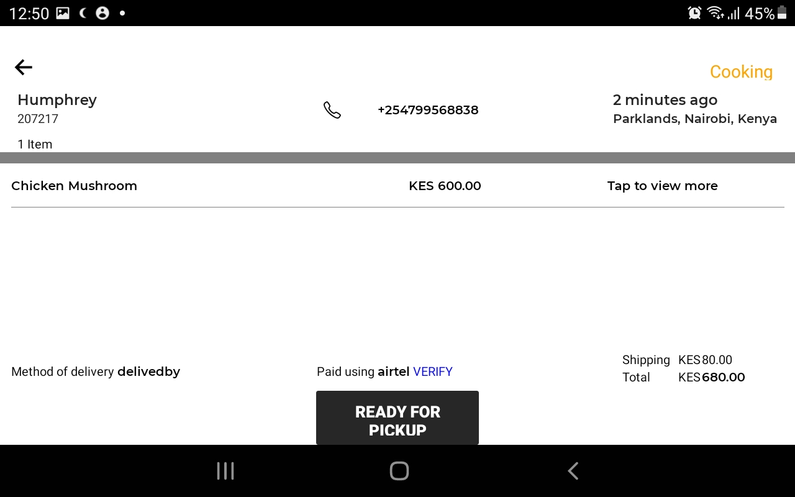</td>
 </tr>
</table>

<table>
 <tr>
  <td>Ready For Pick Up Orders Screen</td>
  <td>Detailed Ready For Pick Up Orders Screen</td>
 </tr>
 <tr>
 <td>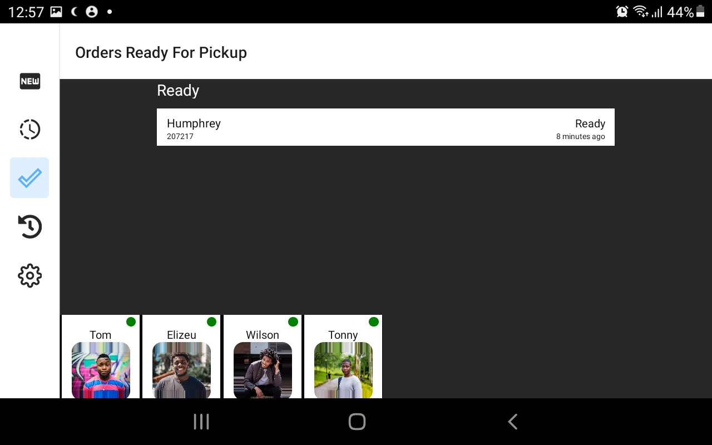</td>
 <td>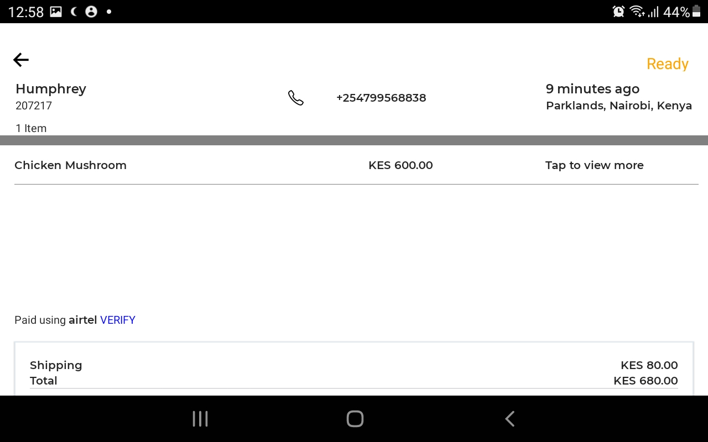</td>
 </tr>
</table>

<table>
 <tr>
  <td>Settings Screen</td>
  <td>App Icon</td>
 </tr>
 <tr>
 <td>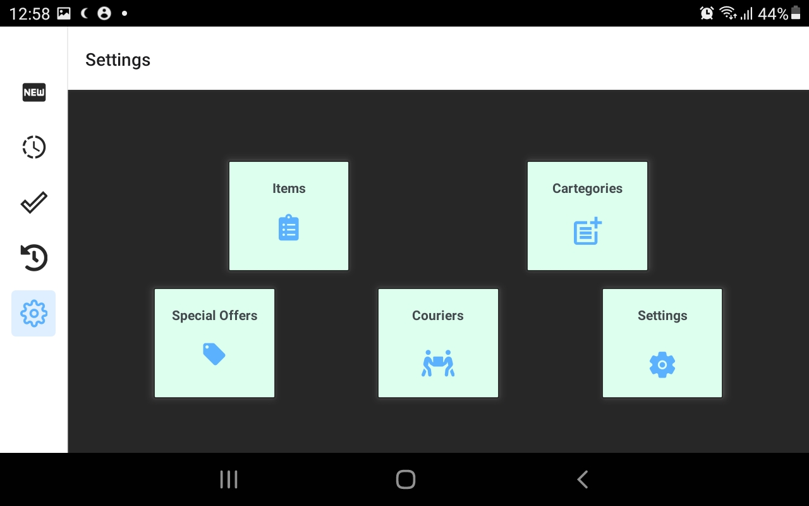</td>
 <td></td>
 </tr>
</table>

<table>
 <tr>
  <td>Available Items Screen</td>
  <td>Create New Item Screen</td>
 </tr>
 <tr>
 <td>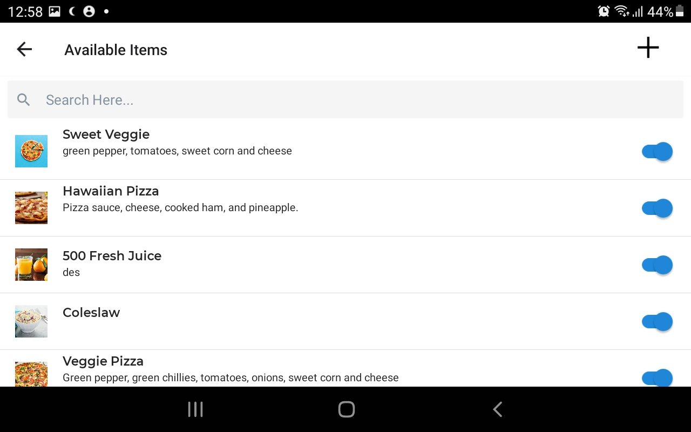</td>
 <td>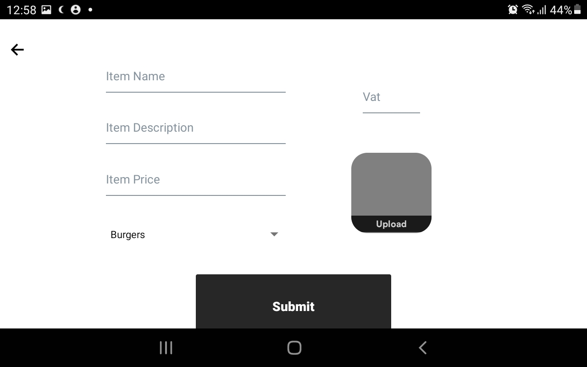</td>
 </tr>
</table>

<table>
 <tr>
  <td>Cartegories Screen</td>
  <td>Registered Couriers Screen</td>
 </tr>
 <tr>
 <td>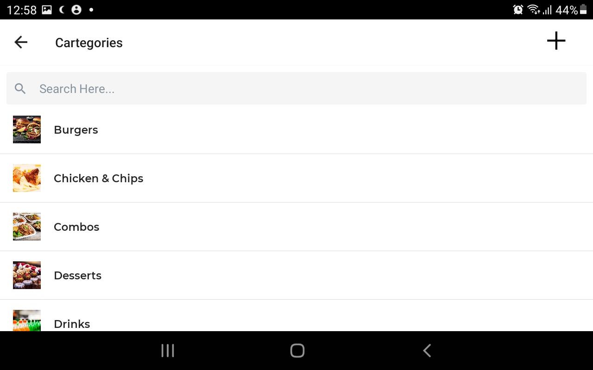</td>
 <td>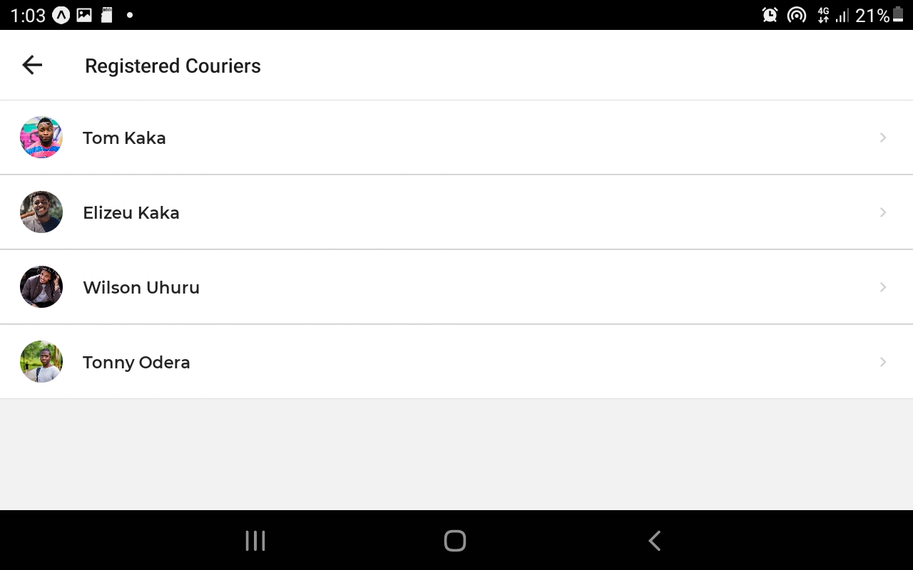</td>
 </tr>
</table>

<table>
 <tr>
  <td>Time Settings Screen</td>
  <td>Time Settings</td>
 </tr>
 <tr>
 <td>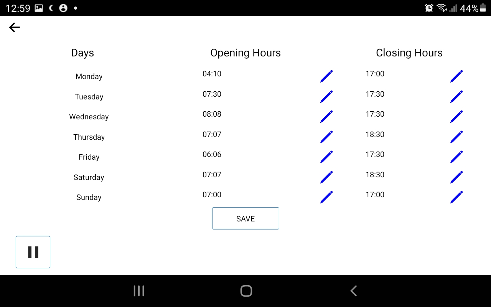</td>
 <td>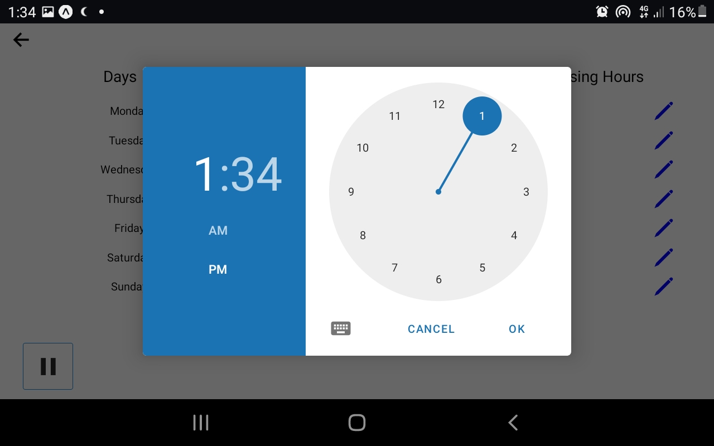</td>
 </tr>
</table>
